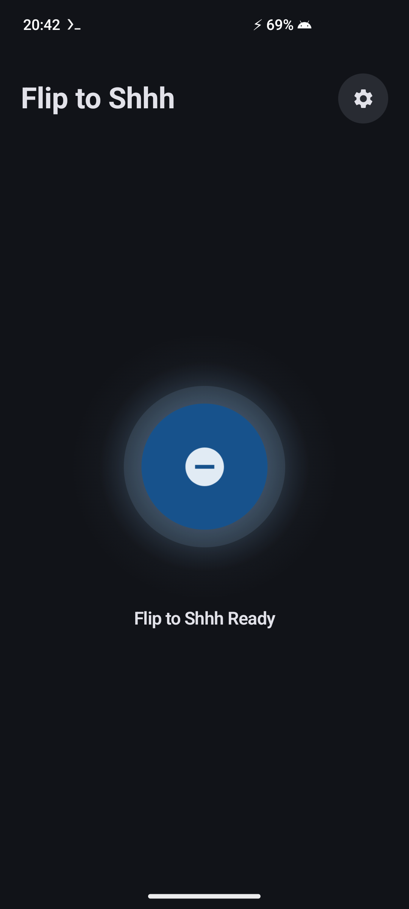
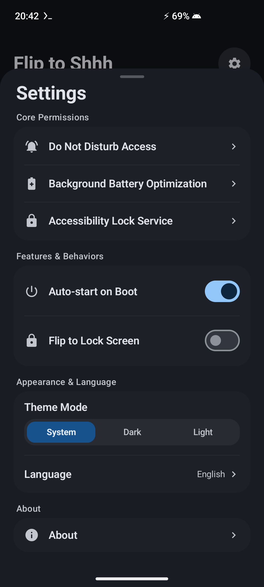
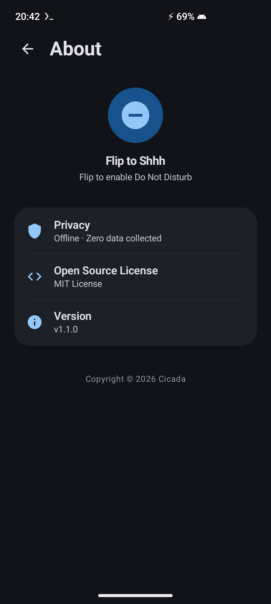

<p align="center">
  <h1 align="center">🤫 Flip to Shhh</h1>
  <p align="center">
    <strong>Ultra-Low Power, Pixel-Grade Flip-to-DND Background Utility for Non-Pixel Android 13+ Devices</strong>
  </p>
  <p align="center">
    <a href="README.md">English</a> •
    <a href="README_zh-CN.md">简体中文</a> •
    <a href="README_zh-TW.md">繁體中文</a>
  </p>
  <p align="center">
    <a href="https://github.com/wg2038/f2shhh/releases"></a>
    
    
    
    
    
    <a href="LICENSE"></a>
  </p>
</p>

<br>

<p align="center">
  <a href="docs/screenshots/en/main_screen.png">
    
  </a>
  &nbsp;&nbsp;&nbsp;&nbsp;
  <a href="docs/screenshots/en/settings_sheet.png">
    
  </a>
  &nbsp;&nbsp;&nbsp;&nbsp;
  <a href="docs/screenshots/en/about_screen.png">
    
  </a>
</p>

---

## 📖 Introduction

**Flip to Shhh** is an open-source, privacy-first, ultra-lightweight (~2.2 MB) background utility designed to bring Google Pixel's signature **Flip to Shhh (Flip to Do Not Disturb)** feature to all non-Pixel Android 13+ devices (including Samsung One UI, Xiaomi HyperOS, OPPO ColorOS, vivo OriginOS, OnePlus OxygenOS, Motorola MyUX, etc.).

Simply place your phone face down flat on a desk or table for 2 seconds. The app instantly enables Do Not Disturb (DND) mode with crisp dual-pulse tactile haptic feedback and optional screen locking. Picking up or flipping the phone face-up automatically restores normal ringer settings within 300ms.

---

## ✨ Feature Highlights

- 🎯 **Pixel-Grade Flip Detection**: Rigorous sensor fusion incorporating gravity vectors, horizontal tilt angles, proximity status, and a continuous 2.0s table stillness window.
- 📳 **Standard Dual-Pulse Haptic Engine**: Delivers a crisp tactile "thud-thud" confirmation when DND activates, and a gentle click when exiting.
- 🔒 **Biometric-Friendly Screen Lock**: Utilizes Android's native `GLOBAL_ACTION_LOCK_SCREEN` API via an Accessibility Service, allowing immediate Fingerprint or Face Unlock without forcing PIN/password input.
- 🧠 **Smart DND Ownership Tracking**: Intelligently detects pre-existing system DND schedules (e.g., bedtime mode from 23:00 to 07:00). Flipping up will never inadvertently disable an active system schedule.
- ⚡ **Ultra-Low Power Consumption**: Leverages hardware sensor event processing and minimal event callbacks, allowing the CPU to stay in deep sleep.
- 🛡️ **100% Offline & Zero Telemetry**: Manifest contains **zero network permissions** (`INTERNET` permission is completely omitted). No analytics, no ads, zero data collected.
- 🚀 **Extreme APK Slimming (~2.2 MB)**: Pure Kotlin and Jetpack Compose with custom vector assets, achieving a 96% size reduction compared to standard icon packs.
- 🎨 **Samsung One UI Inspired Aesthetic**: Smooth breathing hero centerpiece, dynamic Material You / One UI palette adaptation, and full tri-lingual localization (Simplified Chinese, Traditional Chinese, English).

---

## 🏗️ Technical Architecture & Implementation Principles

### 1. High-Precision Flip Detection Mechanism

Traditional flip detection solutions often suffer from false triggers when a user leans their phone against an object, places it in a car mount, or holds it tilted in hand. **Flip to Shhh** re-engineers this logic using multi-sensor fusion:

```
                  ┌────────────────────────┐
                  │ Gravity / Accel Sensor │
                  └───────────┬────────────┘
                              │
                              ▼
        ┌──────────────────────────────────────────────┐
        │  1. Spatial Flatness Check                   │
        │     • Z <= -9.0 m/s²                         │
        │     • √(X² + Y²) <= 2.5 m/s² (Tilt <= 15°)   │
        └─────────────────────┬────────────────────────┘
                              │ PASS
                              ▼
        ┌──────────────────────────────────────────────┐
        │  2. Proximity Sensor Fusion                  │
        │     • Optical Sensor: Distance == NEAR       │
        │     • Virtual Sensor fallback: Bypass check  │
        └─────────────────────┬────────────────────────┘
                              │ PASS
                              ▼
        ┌──────────────────────────────────────────────┐
        │  3. Continuous 2.0s Table Stillness Window   │
        │     • Hand Tremor Filter (Gyro < 0.05 rad/s) │
        │     • Micro-Acc Filter (ΔG < 0.07 m/s²)      │
        └─────────────────────┬────────────────────────┘
                              │ 2000ms Elapsed
                              ▼
                 ✅ Trigger DND + Haptic + Lock
```

- **Spatial Vector Analysis**: Evaluates continuous gravity coordinates $(X, Y, Z)$. The phone is considered face-down only when $Z \le -9.0\text{ m/s}^2$ and the horizontal component $\sqrt{X^2+Y^2} \le 2.5\text{ m/s}^2$ (corresponding to a strict spatial tilt angle $\le 15^\circ - 23^\circ$).
- **Optical vs. Virtual Proximity Discrimination**: The service checks hardware vendor signatures (`isHardwareOpticalProximity`). For devices with genuine optical sensors (e.g., Pixel, Xiaomi), proximity `NEAR` is strictly required. For devices with virtual/ultrasonic proximity sensors (e.g., certain Samsung models), it gracefully falls back to dual-track gyroscope and micro-acceleration stillness filtering.
- **Physiological Hand Tremor Filter**: During the 2.0s countdown, human hand micro-vibrations (8–12 Hz muscle tremor, $\omega > 0.05\text{ rad/s}$ or $\Delta G > 0.07\text{ m/s}^2$) instantly reset the debounce timer, preventing accidental activation while holding the phone face down mid-air.
- **Asymmetric Fast Exit**: Picking up or tilting the phone beyond threshold ($Z > -7.5\text{ m/s}^2$ or horizontal $> 3.5\text{ m/s}^2$) triggers exit debounce in just 300ms, restoring sound immediately.

---

### 2. DND Invocation Flow & Interruption Filter State Machine

To guarantee seamless integration with system sound settings without conflicting with existing schedules:

```
[Phone Placed Face Down (2.0s)]
               │
               ▼
[Trigger Dual-Pulse Vibration] (AudioAttributes: USAGE_ASSISTANCE_SONIFICATION)
               │
               ▼
[Inspect Interruption Filter]
   ├── Filter == INTERRUPTION_FILTER_ALL
   │      └── Set to INTERRUPTION_FILTER_PRIORITY (wasDndActivatedByService = true)
   └── Filter != INTERRUPTION_FILTER_ALL (External DND already active)
          └── Keep current filter (wasDndActivatedByService = false)
               │
               ▼
[Execute Auto-Lock] (via GLOBAL_ACTION_LOCK_SCREEN)
```

```
[Phone Flipped Up (300ms)]
               │
               ▼
[Check DND Ownership]
   ├── wasDndActivatedByService == true
   │      └── Restore previous Interruption Filter (INTERRUPTION_FILTER_ALL)
   └── wasDndActivatedByService == false
          └── Leave system DND untouched (Preserves bedtime/scheduled DND)
               │
               ▼
[Trigger Flip-Up Haptic Click]
```

- **Haptic Pre-Firing**: Vibration is executed *before* changing DND state and *before* screen locking, using `AudioAttributes.USAGE_ASSISTANCE_SONIFICATION` to prevent the system audio server from muting the feedback.
- **Smart Ownership Tracking**: The service records whether DND was initiated by `FlipToShhhService`. If system DND was already turned on prior to flipping (e.g., scheduled quiet hours), flipping up preserves the system's active DND state.

---

### 3. Fully Local & Offline Architecture Design

- **Zero Network Permissions**: The `AndroidManifest.xml` does not declare `android.permission.INTERNET` or `ACCESS_NETWORK_STATE`. The application is physically incapable of making network requests.
- **Privacy-Preserving Accessibility Configuration**: `FlipLockAccessibilityService` sets `canRetrieveWindowContent="false"` and `accessibilityEventTypes=""`. It does not inspect on-screen text, capture keypresses, or read accessibility nodes—it only invokes `performGlobalAction(GLOBAL_ACTION_LOCK_SCREEN)`.
- **Local Persistence Only**: App preferences and service states are stored locally via Android `SharedPreferences`.

---

## 🛡️ Permissions Overview

| Permission | Identifier | Purpose | Optional / Required |
| :--- | :--- | :--- | :--- |
| **Do Not Disturb Access** | `android.permission.ACCESS_NOTIFICATION_POLICY` | Toggles system DND state when flipping | **Required** |
| **Accessibility Service** | `android.permission.BIND_ACCESSIBILITY_SERVICE` | Non-destructive screen locking (`GLOBAL_ACTION_LOCK_SCREEN`) | *Optional* |
| **Ignore Battery Optimization** | `android.permission.REQUEST_IGNORE_BATTERY_OPTIMIZATIONS` | Prevents OEM aggressive background killing | *Recommended* |
| **Post Notifications** | `android.permission.POST_NOTIFICATIONS` | Displays foreground service status banner (Android 13+) | *Optional* |
| **Boot Completed** | `android.permission.RECEIVE_BOOT_COMPLETED` | Automatically resumes service after device reboot | *Optional* |

---

## 🛠️ Build & Installation

### Requirements
- Android Studio Ladybug (2024.2.1) or newer
- JDK 17
- Android SDK API 34 (Android 14)
- Minimum Deployment Target: Android 13 (API 33)

### Build Steps

```bash
# 1. Clone repository
git clone https://github.com/wg2038/f2shhh.git
cd f2shhh

# 2. Build Debug APK
./gradlew assembleDebug

# 3. Build Release APK (R8 Minified)
./gradlew assembleRelease
```

The compiled release APK is located at:
`app/build/outputs/apk/release/app-release.apk` (~2.2 MB)

---

## 📄 License

This project is licensed under the [MIT License](LICENSE).
