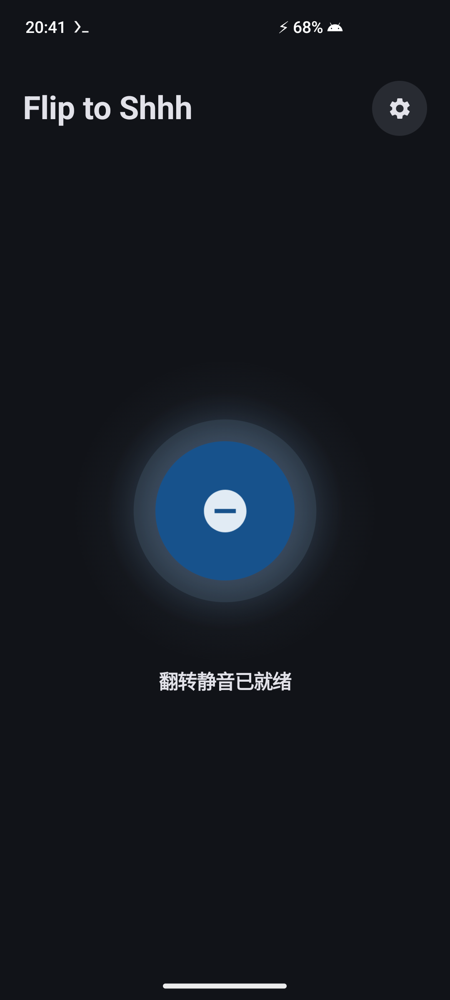
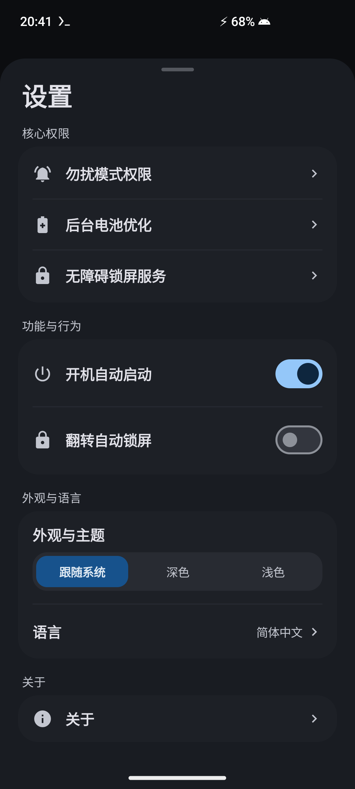
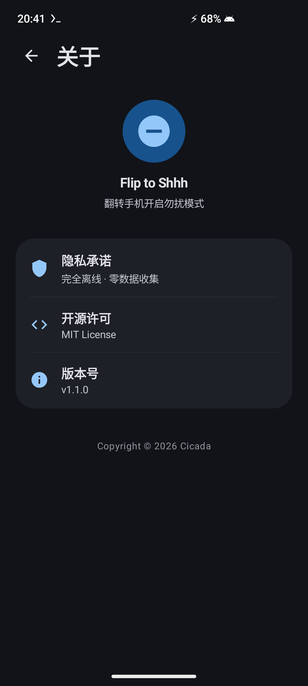

<p align="center">
  <h1 align="center">🤫 Flip to Shhh</h1>
  <p align="center">
    <strong>为非 Pixel 的 Android 13+ 全品牌设备打造的超低功耗 Pixel 级翻转静音/勿扰工具</strong>
  </p>
  <p align="center">
    <a href="README.md">English</a> •
    <a href="README_zh-CN.md">简体中文</a> •
    <a href="README_zh-TW.md">繁體中文</a>
  </p>
  <p align="center">
    <a href="https://github.com/wg2038/f2shhh/actions/workflows/ci.yml"></a>
    <a href="https://github.com/wg2038/f2shhh/releases"></a>
    
    
    
    
    
    <a href="LICENSE"></a>
  </p>
</p>

<br>

<p align="center">
  <a href="docs/screenshots/zh-CN/main_screen.png">
    
  </a>
  &nbsp;&nbsp;&nbsp;&nbsp;
  <a href="docs/screenshots/zh-CN/settings_sheet.png">
    
  </a>
  &nbsp;&nbsp;&nbsp;&nbsp;
  <a href="docs/screenshots/zh-CN/about_screen.png">
    
  </a>
</p>

---

## 📖 项目简介

**Flip to Shhh** 是一款开源、纯净、无广告、极度轻量（~5.1 MB）的后台常驻静音工具。致力于为所有**非 Pixel 的 Android 13+ 设备**（包括三星 One UI、小米 HyperOS、OPPO ColorOS、vivo OriginOS、一加 OxygenOS、摩托罗拉等）带来媲美 Google Pixel 原生的 **Flip to Shhh（翻转开启勿扰）** 体验。

只需将手机屏幕朝下平扣在桌面或平整物体上保持 2 秒，伴随清脆利落的“咚 - 咚”双脉冲触感反馈，自动开启勿扰模式（DND）并可联动原生熄屏锁屏。拿起或翻正手机时，将在 300ms 内灵敏恢复原有响铃状态。

---

## ✨ 功能特性

- 🎯 **Pixel 级高精度翻转判定**：深度融合三轴重力向量、水平倾角、近距离感应与连续 2.0 秒桌面静止窗口，彻底杜绝误触。
- 📳 **标准双脉冲触感震动**：扣下时触发清脆下沉的“咚 - 咚”双脉冲震动（`PRIMITIVE_THUD`），翻起时辅以轻柔微触（`PRIMITIVE_CLICK`）。
- 🔒 **无损原生熄屏锁屏**：基于 Android 原生无障碍服务（`GLOBAL_ACTION_LOCK_SCREEN`），锁屏后仍可直接使用指纹或面部识别解锁，无需强制输入锁屏密码。
- 🧠 **智能 DND 归属追踪**：自动识别系统原有的定时勿扰规则（如 23:00–07:00 睡眠勿扰）。翻转拿起时绝不会误关闭系统原本已开启的定时勿扰。
- ⚡ **超低后台功耗**：采用硬件级传感器低频事件分发，避免 CPU 冗余唤醒，保持系统深度休眠（Deep Sleep）。
- 🛡️ **100% 完全本地与零隐私收集**：Manifest 中**未声明任何网络权限**（`INTERNET` 权限完全剔除），无任何数据统计 SDK、无跟踪、无广告。
- 🚀 **极限界限瘦身（~5.1 MB）**：纯 Kotlin 与 Jetpack Compose 打造，手写精简矢量图资产，相较臃肿图标库瘦身 96%。
- 🎨 **Samsung One UI 风格美学设计**：灵动呼吸感主控中心，完美适配 Material You 与 One UI 动态取色壁纸主题，内置简 / 繁 / 英三语动态无缝切换。

---

## 🏗️ 技术架构与实现原理

### 1. 高精度翻转检测机制 (Flip Detection Algorithm)

传统翻转应用常因手机倾斜靠置、手持晃动或放入车载支架而频繁发生误触发。**Flip to Shhh** 重构了多传感器加权校验管线：

```
                  ┌────────────────────────┐
                  │ 重力 / 加速度传感器监听 │
                  └───────────┬────────────┘
                              │
                              ▼
        ┌──────────────────────────────────────────────┐
        │  1. 空间平放姿态判定 (Spatial Flatness)      │
        │     • Z <= -9.0 m/s²                         │
        │     • √(X² + Y²) <= 2.5 m/s² (水平倾角 <= 15°)│
        └─────────────────────┬────────────────────────┘
                              │ 满足
                              ▼
        ┌──────────────────────────────────────────────┐
        │  2. 近距离传感器智能融合 (Proximity Fusion)   │
        │     • 实体光学感应器：校验 Distance == NEAR  │
        │     • 虚拟/超声波感应器：自动降级跳过实体校验│
        └─────────────────────┬────────────────────────┘
                              │ 满足
                              ▼
        ┌──────────────────────────────────────────────┐
        │  3. 连续 2.0s 桌面物理静止时间窗口 (Stillness)│
        │     • 生理手抖动过滤 (陀螺仪角速度 < 0.05rad/s)│
        │     • 微加速度波动过滤 (ΔG < 0.07 m/s²)      │
        └─────────────────────┬────────────────────────┘
                              │ 倒计时 2000ms 完成
                              ▼
                 ✅ 触发 DND 勿扰 + 双脉冲震感 + 自动熄屏
```

- **三维重力向量解算**：实时监测 $(X, Y, Z)$ 分量。当且仅当 $Z \le -9.0\text{ m/s}^2$ 且水平分量 $\sqrt{X^2+Y^2} \le 2.5\text{ m/s}^2$ 时，判定设备处于水平平放区间（空间倾角 $\le 15^\circ - 23^\circ$）。
- **实体光学 vs. 虚拟超声波近距离判别**：服务底层通过厂商特征识别硬件方案（`isHardwareOpticalProximity`）。具备实体光学传感器的设备必须同时处于 `NEAR` 遮挡态；对部分采用虚拟掌纹/防误触方案的三星机型，则优雅降级为双轨陀螺仪与微加速度静止判定。
- **生理性手颤滤波（Hand Tremor Filter）**：在 2.0 秒倒计时期间，手持手机悬空时的肌肉微颤（8–12 Hz 微震，$\omega > 0.05\text{ rad/s}$ 或 $\Delta G > 0.07\text{ m/s}^2$）会立即重置倒计时，彻底杜绝悬空平放误判。
- **非对称快速退出**：拿起手机或倾角离开阈值（$Z > -7.5\text{ m/s}^2$ 或水平分量 $> 3.5\text{ m/s}^2$）时，仅需 300ms 防抖即刻恢复原有勿扰状态。

---

### 2. 勿扰模式调用流程与状态机设计

为了确保与 Android 系统勿扰策略的无缝协作，避免与用户的自定义规则产生冲突：

```
【手机平扣桌面 2.0 秒】
          │
          ▼
【触发双脉冲触感反馈】(AudioAttributes: USAGE_ASSISTANCE_SONIFICATION)
          │
          ▼
【检查系统当前勿扰模式】
   ├── 当前模式 == INTERRUPTION_FILTER_ALL (勿扰未开)
   │      └── 设为 INTERRUPTION_FILTER_PRIORITY (记录 wasDndActivatedByService = true)
   └── 当前模式 != INTERRUPTION_FILTER_ALL (外部勿扰已生效，如定时睡眠模式)
          └── 保持当前状态不变 (记录 wasDndActivatedByService = false)
          │
          ▼
【执行锁屏操作】(调用 GLOBAL_ACTION_LOCK_SCREEN)
```

```
【手机翻转拿起 300ms】
          │
          ▼
【检查 DND 归属标记】
   ├── wasDndActivatedByService == true
   │      └── 恢复先前的 Interruption Filter (如恢复全部响铃)
   └── wasDndActivatedByService == false
          └── 不做任何修改 (完整保留系统自有的定时勿扰生命周期)
          │
          ▼
【触发翻起轻柔微震】
```

- **触感震动免压制（Pre-Firing）机制**：在修改系统勿扰状态与锁屏前预先调度震动，并为 Vibrator 显式注入 `AudioAttributes.USAGE_ASSISTANCE_SONIFICATION` 音频属性，彻底规避系统 DND 框架对后台震感的拦截压制。
- **智能归属追踪**：严格追踪 DND 的启动来源。若用户在翻转前已手动开启勿扰或正处于定时睡眠模式中，翻起手机时绝不会误关闭系统勿扰，实现零打扰的兼容性。

---

### 3. 完全本地运行与隐私零收集设计

- **零网络权限**：`AndroidManifest.xml` 中未申请 `android.permission.INTERNET` 与 `ACCESS_NETWORK_STATE`，应用在系统级别被物理剥离网络通信能力。
- **高隐私标准的无障碍配置**：`FlipLockAccessibilityService` 在配置中声明 `canRetrieveWindowContent="false"` 且 `accessibilityEventTypes=""`，不抓取任何屏幕文本、不截获键盘输入、不审查 UI 树结构，仅作为调用系统原生 `GLOBAL_ACTION_LOCK_SCREEN` 的轻量通道。
- **数据完全本地化**：用户配置与运行状态均使用 Android 本地 `SharedPreferences` 存储，绝无任何外发行为。

---

## 🛡️ 权限清单说明

| 权限名称 | 对应系统权限 | 用途说明 | 是否必须 |
| :--- | :--- | :--- | :--- |
| **勿扰模式控制** | `android.permission.ACCESS_NOTIFICATION_POLICY` | 翻转扣下时切换系统 Do Not Disturb 状态 | **必须** |
| **无障碍锁屏服务** | `android.permission.BIND_ACCESSIBILITY_SERVICE` | 翻转静音时调用系统原生熄屏锁屏 | *可选* |
| **忽略电池优化** | `android.permission.REQUEST_IGNORE_BATTERY_OPTIMIZATIONS` | 防止后台前台服务被系统电池管理强杀 | *推荐* |
| **通知发送权限** | `android.permission.POST_NOTIFICATIONS` | 显示前台保活常驻状态栏通知（Android 13+） | *可选* |
| **开机自启广播** | `android.permission.RECEIVE_BOOT_COMPLETED` | 设备开机解锁后自动拉起静音监听服务 | *可选* |

---

## 🛠️ 编译与构建说明

### 环境要求
- Android Studio Ladybug (2024.2.1) 或更高版本
- JDK 17
- Android SDK API 34 (Android 14)
- 最低系统支持：Android 13 (API 33)

### 构建命令

```bash
# 1. 克隆代码仓库
git clone https://github.com/wg2038/f2shhh.git
cd f2shhh

# 2. 编译 Debug 测试包
./gradlew assembleDebug

# 3. 编译 Release 正式包 (开启 R8 混淆与极限瘦身)
./gradlew assembleRelease
```

编译输出的正式安装包位于：
`app/build/outputs/apk/release/app-release.apk` (~5.1 MB)

---

## 📄 开源协议

本项目基于 [MIT License](LICENSE) 协议完全开源。
