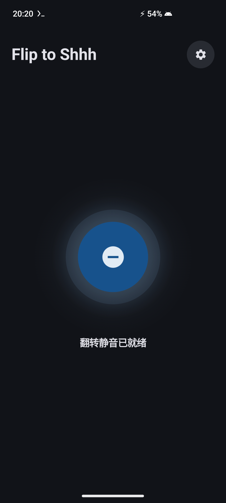
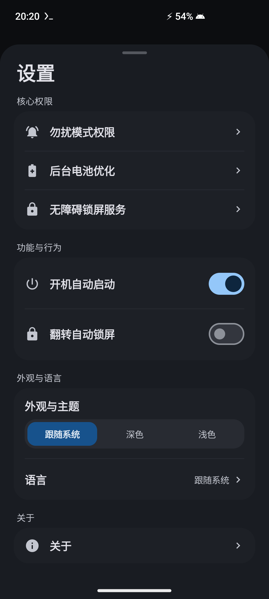
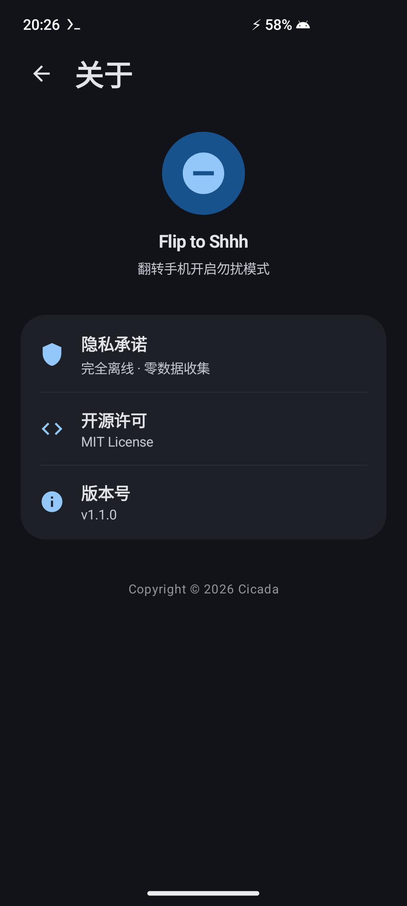

<p align="center">
  <h1 align="center">🤫 Flip to Shhh</h1>
  <p align="center">
    <strong>為非 Pixel 的 Android 13+ 全品牌裝置打造的超低功耗 Pixel 級翻轉靜音/勿擾工具</strong>
  </p>
  <p align="center">
    <a href="README.md">English</a> •
    <a href="README_zh-CN.md">简体中文</a> •
    <a href="README_zh-TW.md">繁體中文</a>
  </p>
  <p align="center">
    <a href="https://github.com/wg2038/f2shhh/releases"></a>
    
    
    
    
    
    <a href="LICENSE"></a>
  </p>
</p>

<br>

<p align="center">
  <a href="docs/screenshots/main_screen.png">
    
  </a>
  &nbsp;&nbsp;&nbsp;&nbsp;
  <a href="docs/screenshots/settings_sheet.png">
    
  </a>
  &nbsp;&nbsp;&nbsp;&nbsp;
  <a href="docs/screenshots/about_screen.png">
    
  </a>
</p>

---

## 📖 專案簡介

**Flip to Shhh** 是一款開源、純淨、無廣告、極致輕量（~2.2 MB）的後台常駐靜音工具。致力於為所有**非 Pixel 的 Android 13+ 裝置**（包括三星 One UI、小米 HyperOS、OPPO ColorOS、vivo OriginOS、OnePlus OxygenOS、Motorola 等）帶來媲美 Google Pixel 原生的 **Flip to Shhh（翻轉開啟勿擾）** 體驗。

只需將手機螢幕朝下平放在桌面或平整物體上保持 2 秒，伴隨清脆俐落的「咚 - 咚」雙脈衝觸感反饋，自動開啟勿擾模式（DND）並可連動原生熄屏鎖屏。拿起或翻正手機時，將在 300ms 內靈敏恢復原有響鈴狀態。

---

## ✨ 功能特性

- 🎯 **Pixel 級高精度翻轉判定**：深度融合三軸重力向量、水平傾角、近距離感應與連續 2.0 秒桌面靜止窗口，徹底杜絕誤觸。
- 📳 **標準雙脈衝觸感震動**：扣下時觸發清脆下沉的「咚 - 咚」雙脈衝震動（`PRIMITIVE_THUD`），翻起時輔以輕柔微觸（`PRIMITIVE_CLICK`）。
- 🔒 **無損原生熄屏鎖屏**：基於 Android 原生無障礙服務（`GLOBAL_ACTION_LOCK_SCREEN`），鎖屏後仍可直接使用指紋或臉部辨識解鎖，無需強制輸入鎖屏密碼。
- 🧠 **智慧 DND 歸屬追蹤**：自動識別系統原有的定時勿擾規則（如 23:00–07:00 睡眠勿擾）。翻轉拿起時絕不會誤關閉系統原本已開啟的定時勿擾。
- ⚡ **超低後台功耗**：採用硬體級感測器低頻事件分發，避免 CPU 冗餘喚醒，保持系統深度睡眠（Deep Sleep）。
- 🛡️ **100% 完全本地與零隱私收集**：Manifest 中**未聲明任何網絡權限**（`INTERNET` 權限完全剔除），無任何資料統計 SDK、無追蹤、無廣告。
- 🚀 **極限界限瘦身（~2.2 MB）**：純 Kotlin 與 Jetpack Compose 打造，手寫精簡向量圖資產，相較臃腫圖示庫瘦身 96%。
- 🎨 **Samsung One UI 風格美學設計**：靈動呼吸感主控中心，完美適配 Material You 與 One UI 動態取色桌布主題，內建簡 / 繁 / 英三語動態無縫切換。

---

## 🏗️ 技術架構與實現原理

### 1. 高精度翻轉檢測機制 (Flip Detection Algorithm)

傳統翻轉應用常因手機傾斜靠置、手持晃動或放入車載支架而頻繁發生誤觸發。**Flip to Shhh** 重構了多感測器加權校驗管線：

```
                  ┌────────────────────────┐
                  │ 重力 / 加速度感測器監聽 │
                  └───────────┬────────────┘
                              │
                              ▼
        ┌──────────────────────────────────────────────┐
        │  1. 空間平放姿態判定 (Spatial Flatness)      │
        │     • Z <= -9.0 m/s²                         │
        │     • √(X² + Y²) <= 2.5 m/s² (水平傾角 <= 15°)│
        └─────────────────────┬────────────────────────┘
                              │ 滿足
                              ▼
        ┌──────────────────────────────────────────────┐
        │  2. 近距離感測器智慧融合 (Proximity Fusion)   │
        │     • 實體光學感應器：校驗 Distance == NEAR  │
        │     • 虛擬/超音波感應器：自動降級跳過實體校驗│
        └─────────────────────┬────────────────────────┘
                              │ 滿足
                              ▼
        ┌──────────────────────────────────────────────┐
        │  3. 連續 2.0s 桌面物理靜止時間窗口 (Stillness)│
        │     • 生理性手抖動過濾 (陀螺儀角速度 < 0.05rad/s)│
        │     • 微加速度波動過濾 (ΔG < 0.07 m/s²)      │
        └─────────────────────┬────────────────────────┘
                              │ 倒數計時 2000ms 完成
                              ▼
                 ✅ 觸發 DND 勿擾 + 雙脈衝震感 + 自動熄屏
```

- **三維重力向量解算**：即時監測 $(X, Y, Z)$ 分量。當且僅當 $Z \le -9.0\text{ m/s}^2$ 且水平分量 $\sqrt{X^2+Y^2} \le 2.5\text{ m/s}^2$ 時，判定裝置處於水平平放區間（空間傾角 $\le 15^\circ - 23^\circ$）。
- **實體光學 vs. 虛擬超音波近距離判別**：服務底層透過廠商特徵辨識硬體方案（`isHardwareOpticalProximity`）。具備實體光學感測器的裝置必須同時處於 `NEAR` 遮蔽態；對部分採用虛擬掌紋/防誤觸方案的三星機型，則優雅降級為雙軌陀螺儀與微加速度靜止判定。
- **生理性手顫濾波（Hand Tremor Filter）**：在 2.0 秒倒數計時期間，手持手機懸空時的肌肉微顫（8–12 Hz 微震，$\omega > 0.05\text{ rad/s}$ 或 $\Delta G > 0.07\text{ m/s}^2$）會立即重置計時，徹底杜絕懸空平放誤判。
- **非對稱快速退出**：拿起手機或傾角離開閾值（$Z > -7.5\text{ m/s}^2$ 或水平分量 $> 3.5\text{ m/s}^2$）時，僅需 300ms 防抖即刻恢復原有勿擾狀態。

---

### 2. 勿擾模式調用流程與狀態機設計

為了確保與 Android 系統勿擾策略的無縫協作，避免與使用者的自定義規則產生衝突：

```
【手機平放桌面 2.0 秒】
          │
          ▼
【觸發雙脈衝觸感反饋】(AudioAttributes: USAGE_ASSISTANCE_SONIFICATION)
          │
          ▼
【檢查系統當前勿擾模式】
   ├── 當前模式 == INTERRUPTION_FILTER_ALL (勿擾未開)
   │      └── 設為 INTERRUPTION_FILTER_PRIORITY (記錄 wasDndActivatedByService = true)
   └── 當前模式 != INTERRUPTION_FILTER_ALL (外部勿擾已生效，如定時睡眠模式)
          └── 保持當前狀態不變 (記錄 wasDndActivatedByService = false)
          │
          ▼
【執行鎖屏操作】(調用 GLOBAL_ACTION_LOCK_SCREEN)
```

```
【手機翻轉拿起 300ms】
          │
          ▼
【檢查 DND 歸屬標記】
   ├── wasDndActivatedByService == true
   │      └── 恢復先前的 Interruption Filter (如恢復全部響鈴)
   └── wasDndActivatedByService == false
          └── 不做任何修改 (完整保留系統自有的定時勿擾生命週期)
          │
          ▼
【觸發翻起輕柔微震】
```

- **觸感震動免壓制（Pre-Firing）機制**：在修改系統勿擾狀態與鎖屏前預先排程震動，並為 Vibrator 顯式注入 `AudioAttributes.USAGE_ASSISTANCE_SONIFICATION` 音訊屬性，徹底規避系統 DND 框架對後台震感的攔截壓制。
- **智慧歸屬追蹤**：嚴格追蹤 DND 的啟動來源。若使用者在翻轉前已手動開啟勿擾或正處於定時睡眠模式中，翻起手機時絕不會誤關閉系統勿擾，實現零打擾的相容性。

---

### 3. 完全本地運行與隱私零收集設計

- **零網絡權限**：`AndroidManifest.xml` 中未申請 `android.permission.INTERNET` 與 `ACCESS_NETWORK_STATE`，應用在系統層級被物理剝離網路通信能力。
- **高隱私標準的無障礙配置**：`FlipLockAccessibilityService` 在配置中聲明 `canRetrieveWindowContent="false"` 且 `accessibilityEventTypes=""`，不擷取任何螢幕文字、不截獲鍵盤輸入、不審查 UI 樹結構，僅作為調用系統原生 `GLOBAL_ACTION_LOCK_SCREEN` 的輕量通道。
- **資料完全本地化**：使用者設定與運行狀態均使用 Android 本地 `SharedPreferences` 存儲，絕無任何外發行為。

---

## 🛡️ 權限清單說明

| 權限名稱 | 對應系統權限 | 用途說明 | 是否必須 |
| :--- | :--- | :--- | :--- |
| **勿擾模式控制** | `android.permission.ACCESS_NOTIFICATION_POLICY` | 翻轉扣下時切換系統 Do Not Disturb 狀態 | **必須** |
| **無障礙鎖屏服務** | `android.permission.BIND_ACCESSIBILITY_SERVICE` | 翻轉靜音時調用系統原生熄屏鎖屏 | *可選* |
| **忽略電池優化** | `android.permission.REQUEST_IGNORE_BATTERY_OPTIMIZATIONS` | 防止後台前台服務被系統電池管理強殺 | *推薦* |
| **通知發送權限** | `android.permission.POST_NOTIFICATIONS` | 顯示前台保活常駐狀態列通知（Android 13+） | *可選* |
| **開機自啟廣播** | `android.permission.RECEIVE_BOOT_COMPLETED` | 裝置開機解鎖後自動拉起靜音監聽服務 | *可選* |

---

## 🛠️ 編譯與構建說明

### 環境要求
- Android Studio Ladybug (2024.2.1) 或更高版本
- JDK 17
- Android SDK API 34 (Android 14)
- 最低系統支援：Android 13 (API 33)

### 構建命令

```bash
# 1. 複製程式碼庫
git clone https://github.com/wg2038/f2shhh.git
cd f2shhh

# 2. 編譯 Debug 測試包
./gradlew assembleDebug

# 3. 編譯 Release 正式包 (開啟 R8 混淆與極限瘦身)
./gradlew assembleRelease
```

編譯輸出的正式安裝包位於：
`app/build/outputs/apk/release/app-release.apk` (~2.2 MB)

---

## 📄 開源協議

本專案基於 [MIT License](LICENSE) 協議完全開源。
