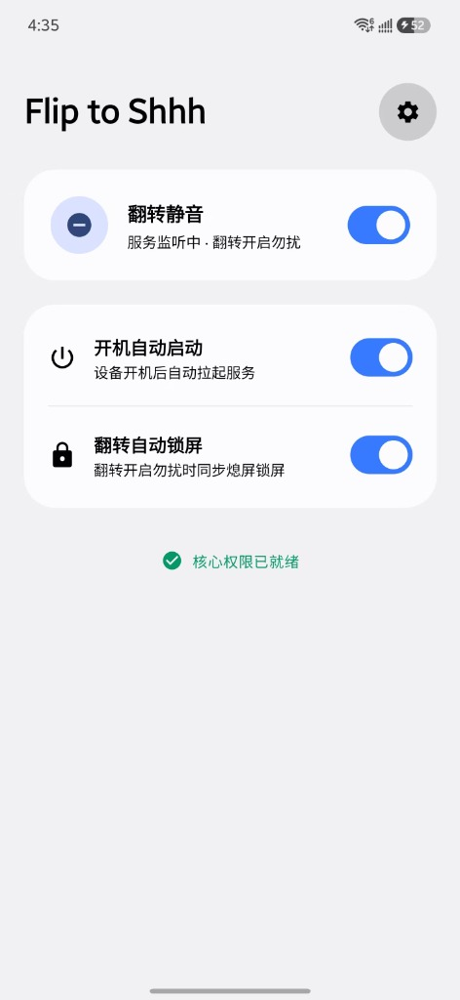
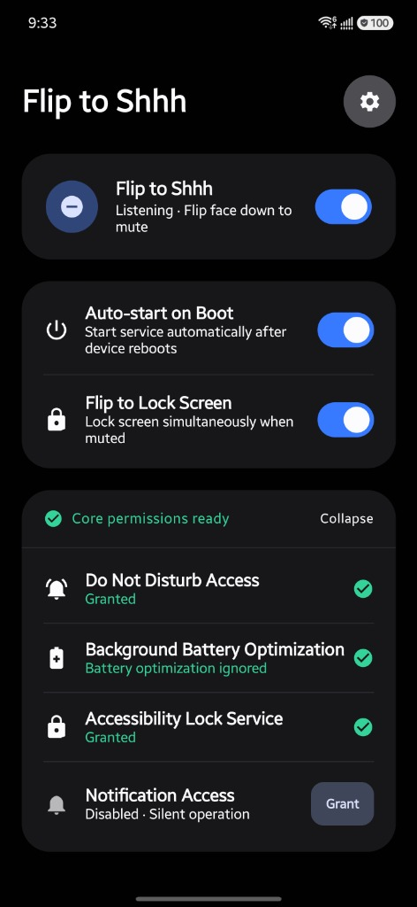

<p align="center">
  <h1 align="center">🤫 Flip to Shhh</h1>
  <p align="center">
    <strong>專為 Samsung Galaxy S 系列（Android 13+）打造的高精度、超低功耗常駐翻轉勿擾工具</strong>
  </p>
  <p align="center">
    <a href="README.md">English</a> •
    <a href="README_zh-CN.md">简体中文</a> •
    <a href="README_zh-TW.md">繁體中文</a>
  </p>
  <p align="center">
    <a href="https://github.com/wg2038/f2shhh/releases/latest"></a>
    
    
    
    
    <a href="LICENSE"></a>
  </p>
</p>

<p align="center">
  
  &nbsp;&nbsp;
  
  &nbsp;&nbsp;
  
</p>

---

## 📖 專案簡介

**Flip to Shhh** 是一款專為 Samsung Galaxy S 系列旗艦智慧型手機（Android 13+）打造的無廣告、超低功耗常駐翻轉靜音工具。只需將手機螢幕朝下放置在桌面上，即可瞬時開啟勿擾模式（DND）並自動熄屏鎖屏，同時伴隨地道的 Samsung One UI 雙脈衝觸感震動反饋。

---

## ⚡ 核心技術架構與亮點

### 1. 純重力向量演算法（不依賴光線/近距離感測器）
不同於傳統靜音應用依賴屏下光線/近距離感測器持續輪詢（會導致三星屏下光線感測器發熱與阻斷 CPU 深度休眠），**Flip to Shhh** 完全基於 `TYPE_GRAVITY`（重力向量）與 `TYPE_GYROSCOPE`（陀螺儀）融合演算法，保證裝置進入 Deep Sleep 深度休眠。

### 2. 硬體 FIFO 批量上報（50ms 延遲）
透過 `BATCH_LATENCY_US = 50_000` 訂閱 Sensor Hub 硬體 FIFO 隊列。感測器資料由低功耗 DSP 協處理器在 50ms 週期內批量處理，極大降低 CPU 喚醒頻率，實現近乎為零的後台功耗。

### 3. 雙閾值遲滯（Hysteresis）與物理靜止校驗
為防止手持走路、口袋晃動或桌面微顫引發誤觸發：
- **進入條件**：垂直重力 $Z \le -9.0\text{ m/s}^2$、水平傾角分量 $\sqrt{X^2+Y^2} \le 1.8\text{ m/s}^2$（傾角最大約 23°）、加速度變化率 $\Delta G \le 0.15\text{ m/s}^2$、陀螺儀角速度 $\omega \le 0.08\text{ rad/s}$。
- **退出條件**：$Z > -7.0\text{ m/s}^2$ 或水平分量 $> 2.8\text{ m/s}^2$。

### 4. 無損鎖屏與 DND 智慧歸屬追蹤
- **完美保留生物識別解鎖**：基於 Android 原生無障礙服務（`GLOBAL_ACTION_LOCK_SCREEN`），鎖屏後仍可順暢使用指紋與人臉解鎖（避免了傳統 DeviceAdmin API 導致必須輸入 PIN/密碼的缺陷）。
- **DND 智慧歸屬追蹤**：自動相容系統定時勿擾（如 23:00–07:00）。若扣下手機前系統已被定時器開啟勿擾，翻轉朝上時**絕不會誤將系統勿擾關閉或反向誤拉起**，完全尊重系統自身的生命週期。

---

## 🛡️ 權限說明與隱私安全

- 🔒 **勿擾權限** (`ACCESS_NOTIFICATION_POLICY`)：用於切換系統 Do Not Disturb 狀態。
- ♿ **無障礙服務** (`GLOBAL_ACTION_LOCK_SCREEN`)：可選權限，僅用於翻轉扣下時調用系統原生熄屏鎖屏。
- 🔋 **忽略電池優化**：確保後台感測器監聽在 One UI 記憶體清理下穩定存活。
- 🛡️ **100% 完全離線**：Manifest 中**未聲明任何網絡權限**（`INTERNET`），無廣告、無任何資料統計與上報，零隱私洩露隱患。

---

## 🛠️ 編譯構建指南

### 環境要求
- Android Studio Ladybug | 2024.2.1 或更新版本
- JDK 17
- Android SDK API 34

### 編譯 Release 包

```bash
git clone https://github.com/wg2038/f2shhh.git
cd f2shhh
./gradlew assembleRelease
```

編譯產生的 Release APK 位於：
`app/build/outputs/apk/release/app-release.apk`

---

## 📄 開源許可

本專案基於 [Apache License 2.0](LICENSE) 開源協議發布。
